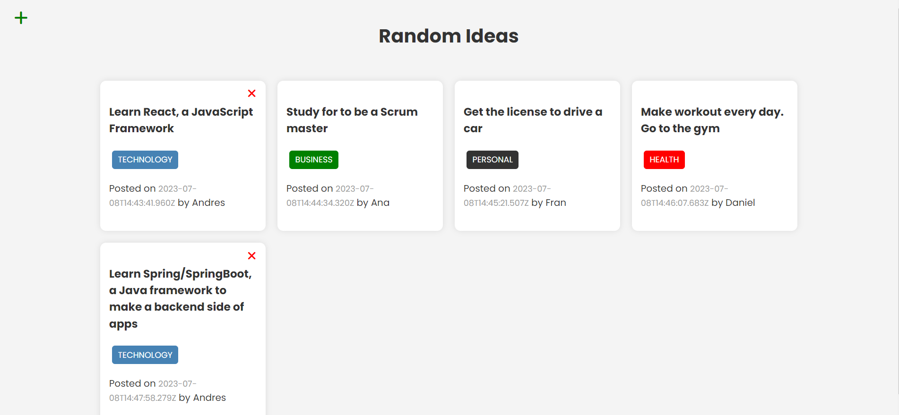

# RandomIdeas App

## Description

This app is a CRUD of ideas, where you can create, read, update and delete ideas. The app is deployed in Heroku and the database is in MongoDB Atlas.
This proyect is part of the course **Modern JS From The Beginning 2.0** [Brad Traversy](https://www.traversymedia.com/)

## User Interface

## Tecnologies

- HTML
- CSS
- JavaScript
- Bootstrap 4
- Babel
- Webpack
- MiniCssExtractPlugin
- Node.js
- Express
- MongoDB
- Mongoose
- Postman
- Render

## Aplication Deployed Link

[RandomIdeas App](https://random-ideas-app-b4jp.onrender.com/)
